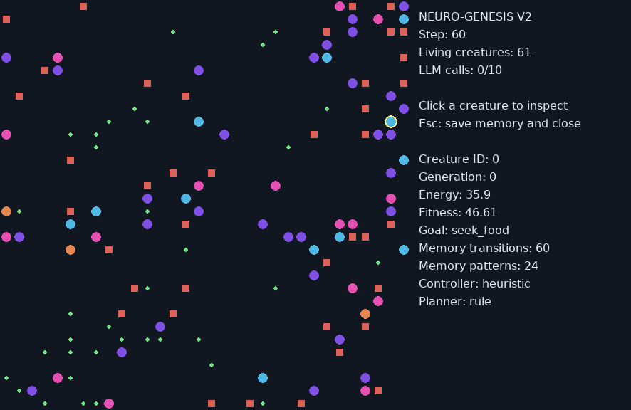

# Persistent Memory + LLM Strategy Brain + PPO

Implemented on Evolution V2 (`32fac513`). Existing population/evolution APIs,
legacy simulators, replay, and saved evolutionary experiments are preserved.
NBB Market Lab is not involved.

## Launch the new viewer

From the repository root (Python with Pygame installed):

```bash
python -m experiments.strategy_runner --render
```

Click a creature to inspect its goal, energy, generation, memory and planner
source. Esc or closing the window saves memory. The viewer is passive: a newborn
without a controller is displayed until it can first act on the next tick.
The old `main.py` still launches the legacy simulation shown in earlier images.



Headless run, persistent memory across successive invocations:

```bash
python -m experiments.strategy_runner --episodes 2 --population 12 --steps 200 --output runs/my-creatures
```

The rule/heuristic headless mode needs only standard-library Python. Rendering
adds Pygame; PPO adds PyTorch. Independent experiments should use different output
folders or `--namespace` values. Output JSONL appends; new sessions are identified
in `session.json`. Do not write to one output directory from multiple processes.

## Persistent memory: what is actually remembered

`memory/episodic.py` stores bounded empirical state/action/reward associations,
not a fictional spatial map. Keys use own energy bucket plus immediate local
food/hazard/occupancy/boundary sensors. Each action retains visit count and mean
observed reward. The low-level controller uses confidence-shrunk action values.
There are up to 128 local patterns and 16 episode summaries per creature.
No full-world coordinates, hidden resource information or other agents' memories
are added. Memory is not inherited automatically at reproduction.

Memory files are atomic versioned JSON, with strict owner/sensor schema checks,
finite values and a file size limit. Founders deliberately reuse experience
across episodes; child namespaces include session and episode so recycled
integer IDs cannot accidentally load an unrelated child's memory. Each file is
bounded; a long series of sessions can still create more dead-child files.
Those files are not automatically deleted.

`enabled=False` provides an actual memory ablation: no state/reward accumulation,
no episode summaries and zero memory features. Persistent memory does not imply
that it improves performance. Experience summaries may encourage repeating
reward exploits; inspect outcomes and comparisons.

## High-level strategy, local control

`brains/strategy.py` permits only four goals: `seek_food`, `avoid_competition`,
`explore`, `protect_energy`. The heuristic translates a goal into local action
scores; PPO receives a one-hot goal feature. The strategy model cannot execute
Python, use tools, set actions directly, modify world parameters or access hidden
world state.

Default `RulePlanner` is explicitly a deterministic baseline, not an LLM.
To use a model already installed in your local Ollama:

```bash
python -m experiments.strategy_runner --render --planner ollama --model qwen3:8b --max-calls 10
```

The model name is an example; supply one actually installed on your computer.
This does not download models. Default endpoint is `http://127.0.0.1:11434` on the
machine running Python, configurable with `--endpoint`.

A strategy request occurs at the first decision, then only after a minimum 20
ticks when low-energy/food/hazard/crowding conditions change, or after 80 ticks.
All agents in the demo share a **10-request budget for the session**, including
failed attempts. Requests are synchronous and bounded by a 10-second HTTP timeout;
the first implementation may pause the viewer during a local inference. It is
not an asynchronous real-time scheduler. With a small shared budget, early agents
may consume requests before later agents; later agents use labeled rule fallback.

Static instructions and bounded dynamic summaries are sent as separate messages.
There is no ever-growing chat history. Ollama uses `stream=false`, JSON format,
`think=false`, temperature 0, a 96-token output limit, 2048-token context setting,
and model keep-alive. Provider behavior/caching is not assumed. Responses must
pass an exact goal/confidence/reason schema. Invalid, low-confidence, timed-out or
budget-exhausted responses use labeled fallback and consume the cooldown rather
than retrying each frame. `strategy.jsonl` records goal, source, reason, request
attempts, error type and available token usage. No credentials are used/logged.

The adapter follows the [official Ollama chat API](https://docs.ollama.com/api/chat).
Protocol and failure paths were tested with a hermetic simulated transport. No
live Ollama model was available in this build environment, so live LLM quality
and latency remain unverified. All committed experiment scores use **rules**, not
LLM decisions.

## PPO: real on-policy learning

```bash
python -m pip install -r requirements-ppo.txt
python -m experiments.ppo_runner --updates 20 --population 16 --steps 128 --seed 42 --output runs/ppo
python -m experiments.ppo_runner --resume runs/ppo/checkpoint.pt --updates 20 --output runs/ppo-continued
python -m experiments.strategy_runner --render --ppo-checkpoint runs/ppo/checkpoint.pt
```

A small tested 20-update checkpoint is included for immediate demonstration:

```bash
python -m experiments.strategy_runner --render --ppo-checkpoint docs/results/strategy-ppo/demo-checkpoint.pt
```

It is a weak smoke-test model, not the best controller. Plain heuristic currently
performs much better. CPU is the default for this small network; explicitly use
`--device cuda` for training if useful on your machine. No CUDA performance claim
was tested here. Use a compatible PyTorch installation for your GPU.

`brains/ppo.py` implements a shared actor-critic, categorical actions, clipped PPO
objective, GAE, entropy bonus, value loss, gradient clipping, minibatches, multiple
epochs and approximate-KL early stopping. It uses the [PPO objective](https://arxiv.org/abs/1707.06347)
and [GAE](https://arxiv.org/abs/1506.02438). State is the existing 102 local values
plus four goal indicators and five empirical action-value features: **111 inputs**.

Training uses batched inference for all living agents, fresh on-policy data, and
separate advantage recursion for every creature. True deaths have zero value
bootstrap. Time-limit truncations bootstrap the final observation value but cut
the GAE trace. Policy-version checks reject replay from old updates. No heuristic
movement override is applied to a PPO action, so recorded log-probabilities match
the actions executed. Training disables births for stable rollout identity;
deployment remains compatible with continuous-world reproduction.

Training strategy uses deterministic rules; memory starts fresh in every training
episode. Deployment can load older empirical memories, which may shift the input
distribution. Training with live LLM goals or warm lifelong memories needs separate
evaluation. The learner optimizes actual world reward, not evolutionary fitness.
Both are reported so differences are visible.

`checkpoint.pt` contains only state dictionaries/tensors and primitive metadata,
loaded with `weights_only=True`: model, optimizer, local sampling/minibatch RNG,
update count, feature schema and world/seed configuration. Checkpoint boundaries
are completed PPO updates, not arbitrary viewer frames. Resume was checked to
produce identical next rollouts/updates on CPU. PPO checkpoints do not bundle
external Ollama state or persistent demo memory files.

## Evidence and limitations

[Measured training and evaluation records](results/strategy-ppo/README.md) contain
20 actual updates and comparisons over heldout seeds 101/202/303. Training world
seeds are negative and disjoint. Evaluation is frozen, uses fresh memory, and
never changes the trained weights or trainer RNG. Comparisons include random,
plain heuristic, goal-based heuristic with memory disabled/enabled, untrained PPO
and trained PPO.

One training seed plus three evaluation worlds cannot establish statistical
significance or general intelligence. There is no fabricated emergent behavior,
no promise that memory or an LLM is better, and no financial applicability claim.
Longer training, independent training seeds, stronger task curricula and actual
local-LLM ablations are the next research steps.
